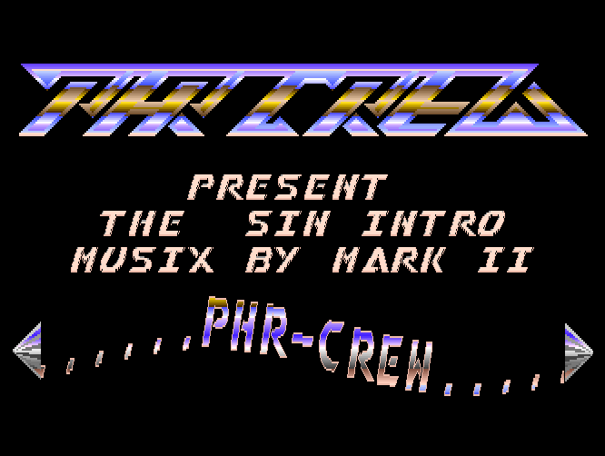

# PHR-CREW - "The Sin Intro"
## An Amiga Demo Disassembly

This is a disassembled and slightly modernized version
of *The Sin Intro* for Commodore Amiga computers by the
scene group [PHR-Crew](https://demozoo.org/groups/49354/),
released in 1988, written in Motorola 68000 assembler.

- Coding: Haegar
- Music: Mark II
- Graphics: Haegar
- Scroll text: Haegar, Phil

The disassembly was done using ReSource V6.06 in WinUAE.

The graphics were extracted from the executable file
using [Maptapper](https://codetapper.com/amiga/maptapper/).

Further editing and testing was done using
[Visual Studio Code](https://code.visualstudio.com/) with the
[Amiga Assembly](https://github.com/prb28/vscode-amiga-assembly)
extension.

## References

* [Demozoo](https://demozoo.org/productions/110495/)
* [Pouet](https://www.pouet.net/prod.php?which=15321)
* [Kestra BitWorld](http://janeway.exotica.org.uk/release.php?id=1693)

## Author
MnemoTroN / Spreadpoint, Feb 2025